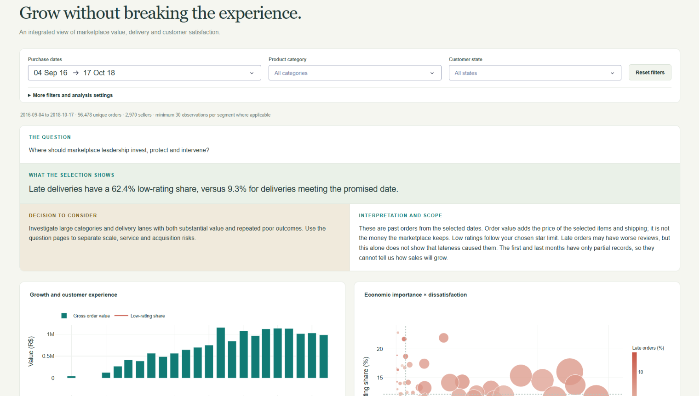
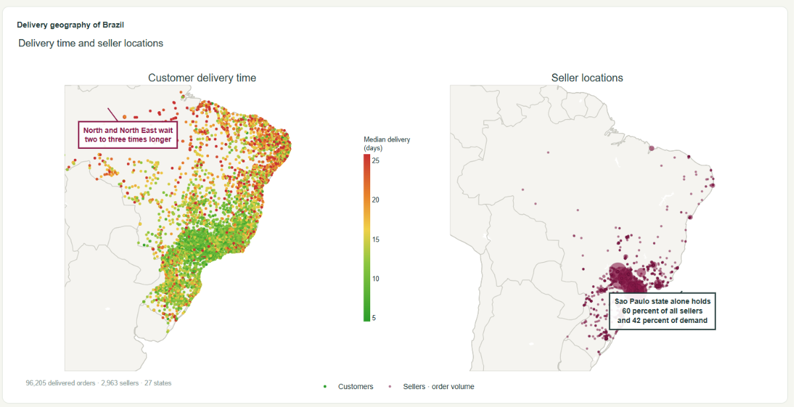

# E-commerce Data Viz

*A visual study of e-commerce orders, delivery, and customer satisfaction.*

An interactive dashboard built with Python, Plotly, and Dash to explore one question: **How can a marketplace grow without breaking the customer experience?**

The analysis follows orders from purchase and payment through delivery and customer reviews. An overview and ten question pages explore repeat purchases, delivery delays, regional demand, seller concentration, and marketing performance. Filters let you compare dates, categories, regions, and sellers.

## Dashboard examples

**Marketplace overview** — filters, key findings, and charts connecting order value with customer satisfaction.



**Delivery geography** — customer delivery times and seller locations across Brazil.



## Data

The E-commerce dataset links Brazilian orders, payments, products, sellers, customers, delivery records, and reviews. The Marketing Funnel dataset adds lead sources, seller conversion, and subsequent trading performance.

Together, they help identify where to improve service, strengthen supply, and support growth. Findings describe observed patterns; they do not establish cause and effect.

## Run locally

From the project folder, create a virtual environment:

```bash
python -m venv .venv
```

Activate it with `source .venv/bin/activate` on macOS/Linux or `.venv\Scripts\Activate.ps1` in Windows PowerShell. Then install dependencies and start the dashboard:

```bash
python -m pip install -r requirements.txt
python app.py
```

Open [localhost:8050](http://127.0.0.1:8050). Data is loaded locally; no API keys are required.

## Core files

| File | Purpose |
| --- | --- |
| `app.py` | Dashboard layout, navigation, filters, and callbacks |
| `analytics.py` | Data filtering, metrics, and charts |
| `data/` | Source datasets and prepared analysis tables |
